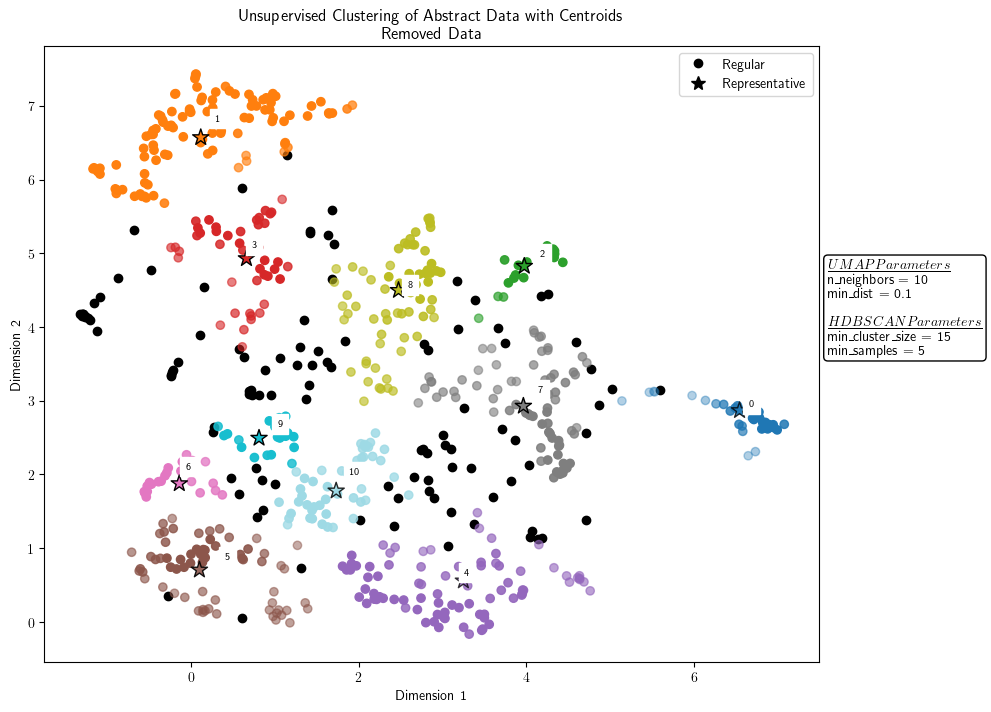
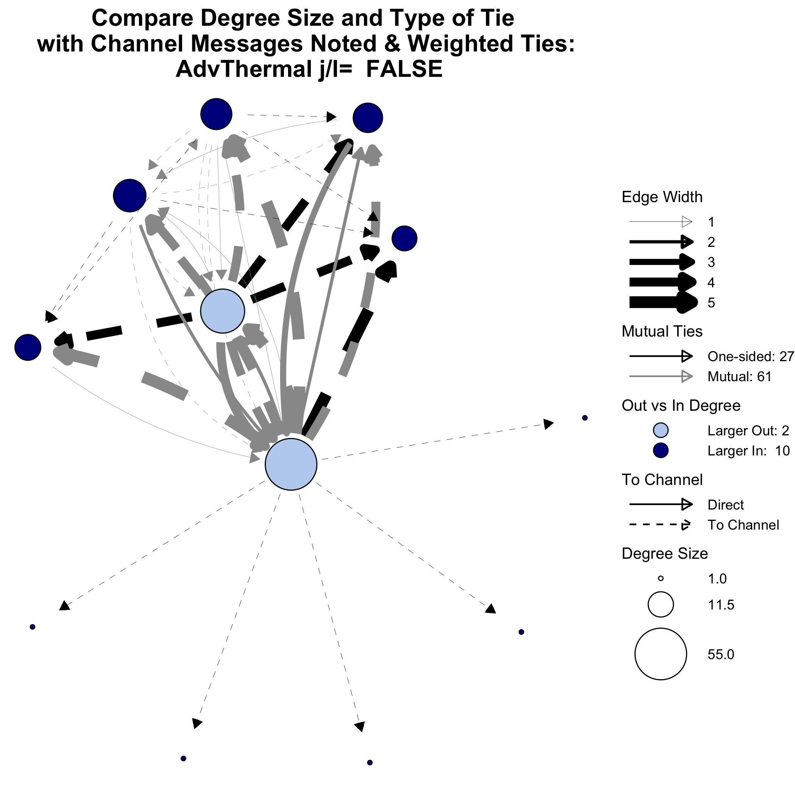

  <body>
  I work with some wonderful humans in the <a href="https://msu-cerl.github.io/" target = "_blank"> Computational Education Research Lab (CERL), </a> under the advisement of <a href="https://dannycaballero.info/" target = "_blank"> Dr. Marcos (Danny) Caballero.</a> The group focuses on understanding how students learn computational tools so that we can more effectively integrate these tools into our classrooms and help our students learn better. 

  <h3>Current Projects</h3>
  

    

        
    

    

    <h4>Using Natural Language Processing to Characterize STEM Education Literature </h4>
      
In collaboration with three other universities, we are conducting a mixed-methods analysis on literature published in the past decade on change strategies for improving undergraduate STEM instruction. Specifically, my work explores the impact and ability of how topic analysis, using statistical methods and Natural Language Processing, can be integrated into systematic literature reviews. This project extends work conducted by <a href= "https://onlinelibrary-wiley-com.proxy2.cl.msu.edu/doi/full/10.1002/tea.20439?casa_token=HcGshgY6EVMAAAAA%3AIMSWsAcNjgkAMkLgRNTbzPAGWiqAHjsrQ-pLjIyxmncwMY1KPa_BXxPjWhTzTU5TNzEp-rYqC3WZ5zk">Henderson, Beach, and Finkelstein. </a>

    

  

  

   

    <h4>Using Social Network Analysis to Understand Online Faculty Learning Communities </h4>
      
I am using Social Network Analysis techniques to model data from a messaging platform consisting of STEM instructors who are looking to incorporate computation into their courses. The goal is to learn which instructors are most active, what sort of relationships the instructors foster, and how these relationships develop over time. Through analyzing these relationships, we can learn what struggles instructors face when looking to incorporate computation into their classrooms and better help them succeed. </a>

    

    

         
    

    
  

  </body>

### A few past projects:

*  <a href="https://academic.oup.com/g3journal/article/9/11/3691/6026746" target = "_blank"> Genomic Prediction of Traits Using Convolutional Neural Networks </a>
    * A summer REU project using Convolutional Neural Networks to predict traits from the genetic information of plants. This model was a part of a larger project that sought to compare the effectiveness of various models in predicting plant traits.
    * Completed under the direction of Dr. Shin-Han Shiu and Dr. Christina Azodi as a part of the <a href="https://icer-acres.msu.edu/" target = "_blank"> iCER ACRES REU. </a>

*  <a href="files/Bolger_Final_Honors_Thesis_2020.pdf" target = "_blank"> Nutrient Intake of Dancers: A Measurement Error Analysis </a>
    * A year-long, undergraduate honors project using measurement error analysis to study what factors influence the nutritional intake of contemporary, collegiate-level dancers.
    * Completed under the advisement of Dr. Brenna Curley in the <a href="https://www.moravian.edu/mathematics" target = "_blank"> Department of Mathematics and Computer Science </a> at Moravian University.